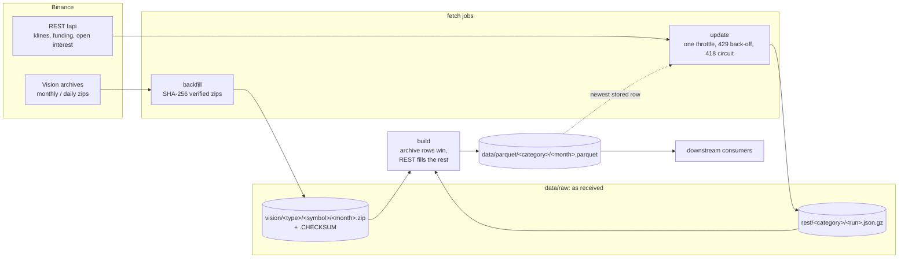

# binance-fetcher

Market-data pipeline for Binance USD-M perpetual futures. It discovers every
listed perpetual, mirrors the Binance Vision bulk archives, keeps five data
families current with rate-limited async REST polling on cron, and builds
monthly Parquet partitions from the two. Fetching and transforming are separate
jobs: the fetch jobs store what the sources served, byte for byte, and `build`
derives every partition from those files alone. Every job is idempotent and
safe to re-run.

| Family | Resolution | Archive (authoritative) | Live tail |
|---|---|---|---|
| OHLCV klines | 1h | Vision monthly zips | REST |
| Mark-price klines | 1h | Vision monthly zips | REST |
| Premium-index klines | 1h | Vision monthly zips | REST |
| Funding rate + funding interval | per settlement | Vision monthly zips | REST |
| Open interest | 1h | Vision daily metrics, packed by month | REST |

## Architecture



- **client/** — async HTTP. REST goes through one throttle; every endpoint
  declares the rate-limit pool it draws from and its real cost. A Vision
  download is returned only once it has passed its checksum.
- **families.py** — one registry that tells every job what a data family is:
  its category, its Vision archive and its REST endpoint, with a parser for
  each.
- **pipeline/** — `backfill` and `update` fetch, `build` transforms.
  `discover` is not a job of its own: both fetch jobs run it first to learn the
  symbol universe.
- **storage/** — the raw store (archives and REST responses, write-once files)
  and the Parquet store (partitions that remember what they were built from).
- **transform/** — Vision CSV and REST JSON to polars frames with one fixed
  schema per category. Only `build` calls them.

The reasoning behind these choices is in [DESIGN.md](DESIGN.md).

## Setup

```bash
uv sync --extra dev            # Python 3.11+; creates .venv from uv.lock
uv run pytest

uv run binance-fetcher backfill && uv run binance-fetcher build     # history
uv run binance-fetcher update && uv run binance-fetcher build       # the live tail
```

Configuration lives in `config.toml`, read from the working directory. Every
key can also be set through the environment as `FETCHER_<KEY>`, for example
`FETCHER_DATA_DIR` or `FETCHER_WEIGHT_PER_MINUTE`; an unknown key in the file
is an error.

## What the data looks like

One month of two symbols, fetched from Vision and built, takes about fifteen
seconds:

```console
$ binance-fetcher backfill --symbols BTCUSDT,ETHUSDT --start 2024-05 --end 2024-05
  ohlcv                  2 symbols, 2 archives (+0 missing, 0 unchanged), 0 failed
  mark_price             2 symbols, 2 archives (+0 missing, 0 unchanged), 0 failed
  premium_index_klines   2 symbols, 2 archives (+0 missing, 0 unchanged), 0 failed
  funding                2 symbols, 2 archives (+0 missing, 0 unchanged), 0 failed
  open_interest          2 symbols, 62 archives (+0 missing, 0 unchanged), 0 failed
Backfill done in 14s
$ binance-fetcher build
  ohlcv                  1 months built (1,488 rows), 0 unchanged, 0 REST files folded
  mark_price             1 months built (1,488 rows), 0 unchanged, 0 REST files folded
  premium_index_klines   1 months built (1,488 rows), 0 unchanged, 0 REST files folded
  funding                1 months built (186 rows), 0 unchanged, 0 REST files folded
  open_interest          1 months built (1,488 rows), 0 unchanged, 0 REST files folded
Build done in 0.1s
$ binance-fetcher validate --daily
All 2 symbols passed validation
```

The raw store holds the archives as Vision served them, with their published
checksums; the 62 daily open-interest files are packed into one ZIP per
symbol and month. The Parquet store holds one partition per family and month:

```
data/raw/vision/klines/BTCUSDT/BTCUSDT-1h-2024-05.zip            (+ .CHECKSUM)
data/raw/vision/fundingRate/BTCUSDT/BTCUSDT-fundingRate-2024-05.zip
data/raw/vision/metrics/BTCUSDT/BTCUSDT-metrics-2024-05.zip     (31 daily CSV members)
...
data/parquet/ohlcv/2024-05.parquet
data/parquet/mark_price/2024-05.parquet
data/parquet/premium_index_klines/2024-05.parquet
data/parquet/funding/2024-05.parquet
data/parquet/open_interest/2024-05.parquet
```

Every partition is plain Parquet, so anything that reads Parquet can use it.
Times are epoch milliseconds, UTC:

```console
$ binance-fetcher query "SELECT symbol, epoch_ms(open_time) AS open_time, open, high, low, close, volume
    FROM 'data/parquet/ohlcv/*.parquet' WHERE symbol = 'BTCUSDT' ORDER BY open_time LIMIT 3"
┌─────────┬─────────────────────┬─────────┬─────────┬─────────┬─────────┬───────────┐
│ symbol  │      open_time      │  open   │  high   │   low   │  close  │  volume   │
├─────────┼─────────────────────┼─────────┼─────────┼─────────┼─────────┼───────────┤
│ BTCUSDT │ 2024-05-01 00:00:00 │ 60651.2 │ 60816.7 │ 60060.6 │ 60217.2 │ 10900.384 │
│ BTCUSDT │ 2024-05-01 01:00:00 │ 60217.3 │ 60389.0 │ 59833.0 │ 60110.6 │ 11290.556 │
│ BTCUSDT │ 2024-05-01 02:00:00 │ 60110.6 │ 60159.2 │ 59555.0 │ 59902.4 │ 13309.707 │
└─────────┴─────────────────────┴─────────┴─────────┴─────────┴─────────┴───────────┘
```

The families share the `(symbol, time)` key, so they join on the hour:

```console
$ binance-fetcher query "SELECT o.symbol, epoch_ms(o.open_time) AS hour, o.close, m.close AS mark_close,
    oi.sum_open_interest AS open_interest
    FROM 'data/parquet/ohlcv/*.parquet' o
    JOIN 'data/parquet/mark_price/*.parquet' m USING (symbol, open_time)
    JOIN 'data/parquet/open_interest/*.parquet' oi ON oi.symbol = o.symbol AND oi.timestamp = o.open_time
    WHERE o.symbol = 'ETHUSDT' ORDER BY hour DESC LIMIT 3"
┌─────────┬─────────────────────┬─────────┬───────────────┬───────────────┐
│ symbol  │        hour         │  close  │  mark_close   │ open_interest │
├─────────┼─────────────────────┼─────────┼───────────────┼───────────────┤
│ ETHUSDT │ 2024-05-31 23:00:00 │ 3764.35 │ 3763.91341667 │   1132153.909 │
│ ETHUSDT │ 2024-05-31 22:00:00 │  3772.9 │ 3772.04628947 │   1130008.103 │
│ ETHUSDT │ 2024-05-31 21:00:00 │ 3788.01 │ 3787.75935606 │   1132887.612 │
└─────────┴─────────────────────┴─────────┴───────────────┴───────────────┘
```

## Commands

The entry point is `binance-fetcher` (or `python -m binance_fetcher`). Every
command accepts `--help`. The global `--config PATH` goes before the command
and selects a config file other than `./config.toml`.

| Command | What it does | Reads | Writes |
| --- | --- | --- | --- |
| `backfill` | Discover symbols, then download every published archive the raw store lacks | Vision | `raw/vision` |
| `update` | Discover symbols, then fetch what is new since the newest stored row | REST | `raw/rest` |
| `build` | Rebuild the partitions whose raw inputs changed | `raw` | `parquet` |
| `validate` | Check OHLC consistency, candle duration and the hourly sequence | `parquet` | |
| `status` | Symbol counts; archives, REST files and partitions per family; latest candle | all | |
| `query` | Run a DuckDB SQL statement over the Parquet files | `parquet` | |

Shared options: `--symbols` is a comma-separated list, case-insensitive.
`--families` is a comma-separated subset of `ohlcv`, `mark_price`,
`premium_index_klines`, `funding`, `open_interest`; the default is every family
enabled in the config, and an unknown name is rejected before any work starts.

### Fetch

```bash
binance-fetcher backfill                                # discover symbols, then every missing archive
binance-fetcher backfill --symbols BTCUSDT,ETHUSDT --start 2024-01 --end 2024-06
binance-fetcher backfill --families ohlcv,funding --workers 12
binance-fetcher backfill --recheck                      # also replace archives Binance has reissued

binance-fetcher update                                  # discover symbols, then every enabled family
binance-fetcher update --families ohlcv,open_interest --symbols BTCUSDT
```

| `backfill` option | Default | |
| --- | --- | --- |
| `--symbols` | discover all, delisted included | skips discovery when given |
| `--families` | all enabled | OHLCV runs first: the other families are planned for the months OHLCV has an archive for |
| `--start` | `start_month` from config | `YYYY-MM` or `YYYY-MM-DD`; a month the window touches is fetched whole |
| `--end` | yesterday | `YYYY-MM` (its last day) or `YYYY-MM-DD` |
| `--workers` | `download_workers` from config | concurrent Vision downloads |
| `--recheck` | off | compare every stored archive in the window with the checksum Vision publishes now, download it again if they differ, and ask again for periods recorded as absent |

The first full backfill and the daily cron run are the same command: the plan
is whatever Vision should have published and the raw store does not hold, so a
rerun downloads only what is new or what an earlier run failed to get.

Without `--symbols`, `update` first refreshes the symbol universe from
`exchangeInfo` (one request): new listings become active, delisted symbols stop
being polled and keep their data, and listing dates are recorded in
`symbol_state.json`. If that request fails, the run carries on with the stored
symbol list and reports the error. An explicit symbol list skips discovery and
also narrows the market-wide funding query.

### Build and inspect

```bash
binance-fetcher build                                   # only the months whose raw inputs changed
binance-fetcher build --families ohlcv --force          # everything, e.g. after a schema change
binance-fetcher build --workers 4                       # parser processes (default: CPU count)
binance-fetcher validate [--symbol BTCUSDT] [--daily]   # --daily also expects 24 candles per day
binance-fetcher status
binance-fetcher query "SELECT symbol, count(*) FROM 'data/parquet/ohlcv/*.parquet' GROUP BY 1"
```

- `validate` checks the built OHLCV only, for one symbol or for all of them.
- `query` passes the SQL to DuckDB as is, so paths in it are relative to the
  working directory, not to `data_dir`.

### Output and exit codes

Each job prints per-family counts on stdout and up to ten error lines on
stderr, next to the JSON logs. `backfill`, `update` and `build` exit non-zero
when anything failed, so cron and CI can alert on them. `validate` reports
problems in its output but always exits 0.

## Cron layout

The hot path runs at :00:30 so the previous hour's candle is closed. `build`
follows each fetch with `;` rather than `&&`: a fetch that failed for a few
symbols still stored the rest.

`flock` keeps the daily line from overlapping the hourly one: two builds
folding the same month at once would trip over each other's file removals.

```crontab
SHELL=/bin/bash
BF=/path/to/binance-fetcher/.venv/bin/binance-fetcher
LOCK=flock -w 3000 /path/to/binance-fetcher/data/meta/.lock

0 * * * *   cd /path/to/binance-fetcher && sleep 30 && $LOCK bash -c "$BF update; $BF build"   >> data/meta/update.log 2>&1
20 4 * * *  cd /path/to/binance-fetcher && $LOCK bash -c "$BF backfill; $BF build"             >> data/meta/backfill.log 2>&1
40 5 2 * *  cd /path/to/binance-fetcher && $LOCK bash -c "$BF backfill --recheck --workers 24; $BF build" >> data/meta/backfill.log 2>&1
```

The monthly `--recheck` is one ~100-byte request per stored monthly archive,
roughly 80,000 for a full history of 570 symbols. Narrow it with `--start`, or
raise `--workers`, if that takes longer than you want.

## Storage layout

```
data/
├── raw/                                        # what the sources served, as received
│   ├── vision/<data_type>/<SYMBOL>/<SYMBOL>-1h-<YYYY-MM>.zip   (+ .CHECKSUM)
│   └── rest/<category>/<fetched_at ms>.json.gz                 (+ residual-<YYYY-MM>.json.gz)
├── parquet/                                    # derived by `build`
│   ├── <category>/<YYYY-MM>.parquet            # all symbols, unique on (symbol, time), sorted
│   └── funding_interval.parquet                # point-in-time funding interval + next settlement
└── meta/                                       # symbol_state.json, cron logs
```

**Raw.** One archive per family, symbol and month, each with a `.CHECKSUM`
sidecar in Vision's own format. Monthly Vision archives are stored byte for
byte, and only after they matched the published SHA-256. Open interest comes
from the daily `metrics` files, which have no monthly layout, so `backfill`
packs them: each day's CSV becomes one member of the month's ZIP, bytes
untouched. The member list says which days are there, the file count drops
thirtyfold, and every later step sees one archive shape. REST responses are
stored one gzipped JSON file per family per run. Raw files are written to a
temp name and renamed into place, and the fetch jobs never parse them.

**Parquet.** Consumers read `data/parquet/<category>/*.parquet` as they are:
partitions are disjoint, deduplicated and sorted. Every quote asset is stored;
filter on `symbol` if only USDT pairs are wanted. The whole directory can be
deleted and rebuilt from `raw/` with `build`. Times are UTC epoch
milliseconds; every partition starts with `symbol`.

| Category | Columns after `symbol` |
|---|---|
| `ohlcv` | `open_time`, `open`, `high`, `low`, `close`, `volume`, `close_time`, `quote_volume`, `trade_count`, `taker_buy_volume`, `taker_buy_quote_volume` |
| `mark_price`, `premium_index_klines` | `open_time`, `open`, `high`, `low`, `close`, `close_time`, `update_count` |
| `funding` | `funding_time`, `funding_rate`, `mark_price` (null where the source lacks it) |
| `open_interest` | `timestamp`, `sum_open_interest`, `sum_open_interest_value` |
| `funding_interval.parquet` | `interval_hours`, `next_funding_time`, `last_funding_rate`, `fetched_at`; one row per symbol, point in time |

## Reliability

**Partitions are a function of the raw files.** A month's partition holds every
row of its archives plus the REST rows no archive has. On a shared
`(symbol, time)` the archive row wins; among REST rows the newest run wins.
Nothing else decides what is stored, so there are no cursors to repair and no
write order to get wrong.

**Reconciliation is a side effect.** The hourly update stores the candle that
is still in progress; the next run fetches it again, closed, and the newer row
replaces it. When Vision publishes the month, `backfill` stores the archive and
the next `build` takes its rows over the REST ones. A packed open-interest
month grows by a day every day and replaces the REST rows as it goes. There is
no reconcile job, no gap-fill job and no diff.

**Only changed months are rebuilt.** Each partition records a fingerprint of
the raw files it was built from (archive names, sizes and mtimes; REST file
names) in its Parquet metadata. `build` skips a month whose fingerprint still
matches, so the hourly run rebuilds the month in progress and nothing else: a
few seconds per family for 570 symbols. When many months do need building (the
first build, `--force`), the archives are parsed in worker processes.

**The REST tail stays short.** Run files pile up hourly. Ten days after a month
ends, `build` folds its run files into one `residual-<month>` file holding only
the rows no archive covers (a snapshot Vision skipped, a symbol Vision never
published) and deletes them. A run file that also holds rows of the following
month waits for that month.

**Stateless backfill plan.** The plan is a directory listing: a month with no
archive file, or the days missing from a packed month's member list. OHLCV is
planned between each symbol's listing date and, once a delisting is scheduled,
its delivery date (both from `exchangeInfo`), and runs first; every other
family is planned for the months OHLCV has an archive for. So nothing is asked
for that cannot exist. A period that is still missing 15 days after it ended is
recorded in the raw store itself, as an archive (or a day member) with nothing
in it: it is asked for once, not on every run, and the plan still reads nothing
but the directory.

**Reissued archives.** Binance occasionally republishes an archive. Every
stored archive has its SHA-256 next to it, so `backfill --recheck` only fetches
Vision's current checksum files, downloads the archives whose checksum moved,
and asks again for the periods recorded as absent. The replaced file changes
its month's fingerprint, and the next `build` rebuilds that month on its own.

**Verified or absent.** A download that fails its checksum or its ZIP CRC is
retried and then raises; a network error raises too. Only a 404 means "not
published". So the raw store never holds unverified bytes, and a bad download
is an error the next run retries, never a silent gap.

**One update process.** `update` fetches every family in one run with one
client, so a single throttle meters everything sent from the host; separate
processes would each assume the full budget. Families are fetched concurrently
(they draw from independent rate-limit pools, with kline requests queued first)
and fail independently, each with its own line in the report and a non-zero
exit if anything failed. Each family is fetched the way the API serves it:
klines per symbol from the newest stored candle, open interest as "the latest N
points" sized to the gap, funding as one market-wide query paged from a
watermark. A full run over ~570 symbols takes under a minute.

**Resuming needs no cursor.** `update` reads where each symbol's data ends from
the built partitions and starts its fetch at that candle, inclusive, because it
was in progress when it was stored. If a build was skipped or a symbol failed,
the next run simply reaches back further. A symbol with nothing stored gets the
62 days one request can carry, which reaches past any month Vision has not
published yet, so the archives and the REST tail meet whichever job ran first.

**Symbol state.** `symbol_state.json` holds only what discovery knows: status,
listing date and delivery date. Discovery rewrites it from `exchangeInfo`, so concurrent jobs
cannot lose anything the next run does not restore.

**Rate limiting.** Binance meters an IP through independent pools, and the
client models each one: request weight per minute for `/fapi/v1` (kline weight
scales with `limit`: 1 to 10), and plain request counts per five minutes for
`/futures/data/*` and for the funding endpoints, which carry no weight and so
never show up in the used-weight header. Each pool is a sliding-window log
rather than a token bucket: a bucket admits a full burst and then refills, so
twice the limit can land inside one server window, while the log holds the
budget inside any window. The server has the last word: a used-weight header
at budget blocks all requests until the next minute, a 429 blocks them for
`Retry-After`, and a 418 opens a circuit so that queued requests fail without
being sent, because traffic during a ban extends it. 429, 5xx and network
errors retry with exponential jitter; every attempt pays for its budget again.

Logs are JSON lines on stderr.

## Known limitations

- **No lock between jobs.** Two `build` processes folding the same month at
  once give one of them a transient error for that family; the next run
  heals it. The cron layout above serialises them with `flock`.
- **A symbol that vanishes from `exchangeInfo` without a delivery date** has
  no upper bound; each of its missing months is recorded as absent once it is
  15 days overdue. Not seen in practice: Binance keeps delisted perpetuals
  listed as `SETTLING`.
- **`funding_interval.parquet` sits loose in `data/parquet/`**, which is
  otherwise one directory per category.
- **`max_concurrent`** could be raised to shorten the hourly run; it is left
  at 15, which finishes a full run in under a minute.

## Development

```bash
uv run ruff check binance_fetcher tests && uv run ruff format --check binance_fetcher tests
uv run mypy binance_fetcher
uv run pytest
```

CI runs lint, format check, mypy and the test suite on Python 3.11, 3.12 and
3.13. Tests cover the raw store (byte-for-byte archives, deterministic
packing), verified downloads, backfill planning, bounds, absent periods,
rechecks and idempotent reruns, build precedence (archive over REST, newest
run over older), fingerprint skipping, folding of the REST tail, rate-limit
pools and the ban circuit, symbol discovery, the update fetch windows,
independent family failures, funding paging, the parsers (Vision and REST
agree, with and without header rows), `validate`, and end-to-end
`update` + `build` runs against a scripted exchange.

## License

MIT, see `LICENSE`.
